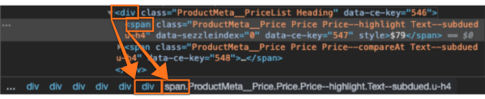

# Local Config
The most important config options are `targetXPath` and `renderToPath`. 
- `targetXPath` tells the widget where to find and extract the product price to calculate the installment price correctly. If the `targetXPath` is incorrect, it may cause one or more of the following issues:
    - No widgets
    - Duplicate widgets
    - Incorrect installment price
- `renderToPath` tells the widget where to appear in relation to the price element. If the `renderToPath` is incorrect, the widget may be hidden or will not render at all.

These two options are also the most difficult to identify correctly. For both, the following conditions apply:

 * IDs need to be preceded by a ’#’ character. 
 * Classes needed to be preceded by a ’.’ character. 
 * Tag names need to be followed by the applicable index. The format of a tagname is as follows: tagName-Index (e.g. ‘SPAN-2’). The indexes are zero-based, such that the first element of the specified type within the parent element is at index 0.
 * The path may contain multiple subpaths. All subpaths need to be separated by the ’/’ character.

## targetXPath

The `targetXPath` is interpreted as follows: The first ID or all occurrences of the first class are found on the page, then that element(s) is checked for all occurrences of the next given subpath. Every element found on the page where all levels of the ID, classes, and tag+index can be applied in order will be given a `data-sezzleindex` attribute. If the renderToPath is found relative to the element, a widget will be created on the page.

To identify the `targetXPath`, complete the following steps:
 * Right-click on the current price element and select Inspect.
    - If the element has an ID or class, copy+paste the following snippet into the Console area and enter the #ID or .class name between the quotations: `document.querySelectorAll('').length`
        - If the result is 1, this is all you need for the targetXPath.
        - If the result is >1, take the class or ID from the parent element (one less indent, or click on the preceding element in the summary bar) 
    - If the element does not have an ID or class, note the tag-name and count the number of elements with that same tag-name that appear <i>before</i> the current price element, including children of sibling elements. This number will be the index.
 * Repeat these steps up as many parent elements as necessary to get to a unique value, adding each parent identifier before the previous value. This is usually only 1-3 levels.

The `targetXPath` value should meet the following criteria:
 * Appears exactly once on the given page.
 * Contains only the current price.
    - Note: You can check the text content of the `targetXPath` by inserting the ID or class closest to the current price element between the quotations of the following snippet: `document.querySelectorAll('')[0].innerText`
 * Is always present on the applicable page type.
    - It is advisable to open a regular-priced product and a sale-priced product in separate tabs to check both variations of the page.

To illustrate, below is the product price area from the Shopify theme Prestige:

```html
<div class="ProductMeta__PriceList">
    <span class="ProductMeta__Price Price--highlight">$20</span>
    <span class="ProductMeta__Price Price--compareAt">$15</span>
</div>
```

WRONG: If `targetXPath: '.ProductMeta__Price'` is applied, two widgets will be created, since that class appears twice.

WRONG: If `targetXPath: 'Price--highlight'` is applied, one widget will be created, but no widget will appear on regular-priced items, since that class only exists if the item is on sale.

WRONG: If `targetXPath: 'ProductMeta__PriceList'` is applied, one widget will be created, but the widget text will reflect both the regular and sale prices in the installment price.

RIGHT: If `targetXPath: 'ProductMeta__PriceList/SPAN-0'` is applied, the widget will render correctly on both regular and sale items, since the current price is always the first child of the container.

RIGHT: Alternatively, `targetXPath: 'ProductMeta__PriceList'` can be used with `ignoredPriceElements: ['.Price--compareAt']` to accomplish the same result.


Let's look at another, more complicated, example. Below is the product price area from the Shopify theme Supply: 

```html
<ul class="inline-list product-meta">
    <li>
        <span id="productPrice-product-template" class="h1">
            <span>$15<sup>00</sup></span>
            <span><small><s>$20<sup>00</sup></s></small></span>
            <span class="visually-hidden">
                <span class="visually-hidden">Regular price</span>$26.00
            </span>
            <span class="visually-hidden">
                <span class="visually-hidden">Sale price</span>$20.00
            </span>
        </span>
        <div class="product-price-unit">
            <span class="visually-hidden">Unit price</span>
            <span></span>
            <span>/</span>
            <span class="visually-hidden">&nbsp;per&nbsp;</span>
            <span>
                <span></span>
            </span>
        </div>
    </li>
    <li>
        <span id="comparePrice-product-template" class="sale-tag large">Save $6</span>
    </li>
</ul>
```

WRONG: If `targetXPath: '.product-meta/#productPrice-product-template'` is applied, an error will show in the console `element.getElementById is not a function`. Because an ID should only appear once per page, if an ID is used, it must start the targetXPath.

WRONG: If `targetXPath: '#productPrice-product-template'` is applied, one widget is created, but the widget text will reflect all the inner text content in the installment price.

WRONG: If `targetXPath: '#productPrice-product-template/SPAN-0'` is applied, the installment price will be incorrect since the price text does not have a period separating dollars from cents.
    Note: This can work if the theme is updated to add the period delimiter. 

WRONG: If `targetXPath: '#productPrice-product-template/.visually-hidden'` is applied, two widgets will be created, since that class appears twice within the container specified by the ID. Also the widget text will reflect the non-price text in the installment price.

WRONG: If `targetXPath: '#productPrice-product-template/SPAN-4'` is applied, one widget will be created, but no widget will appear on regular-priced items, since there is only one child span within the container specified by the ID for non-sale items.

RIGHT: If `targetXPath: document.querySelector('#productPrice-product-template').getElementsByTagName('span').length > 2 ? '#productPrice-product-template/SPAN-4' : '#productPrice-product-template/.visually-hidden'` is applied with `ignoredFormattedPriceText: ['Sale price', 'Regular price']`, the widget will render correctly on both regular and sale items, as the function checks whether the item is on sale and applies the targetXPath accordingly AND the non-price text is extracted from the inner text before rendering the installment price.


## renderToPath

